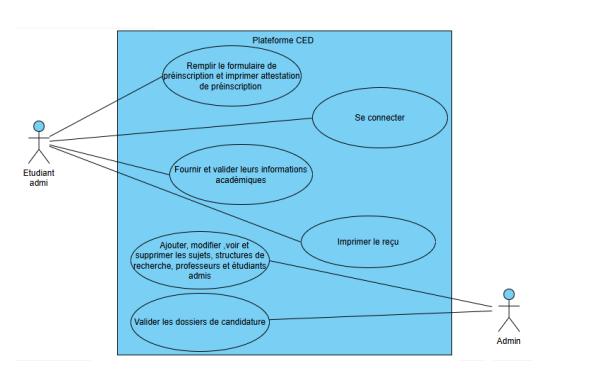
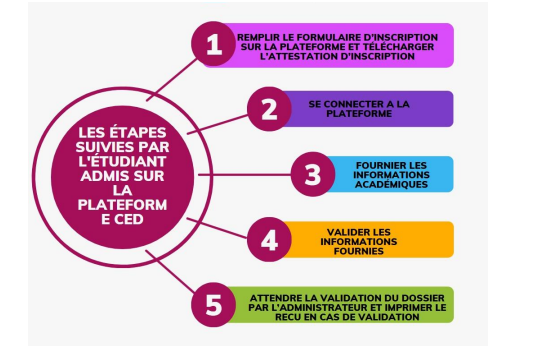
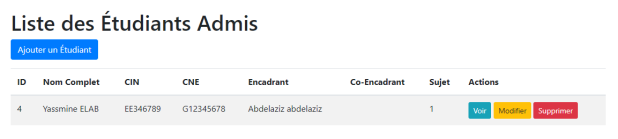
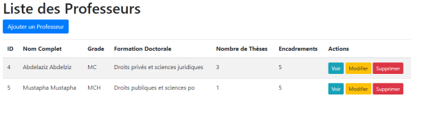
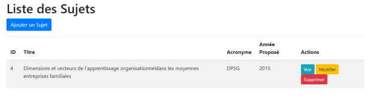
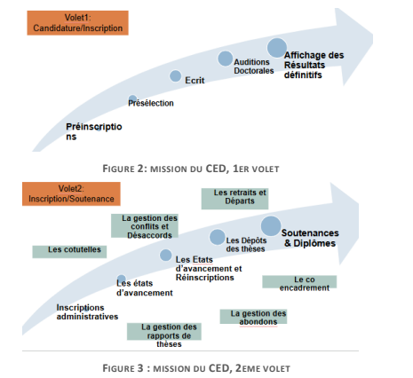
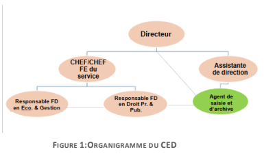
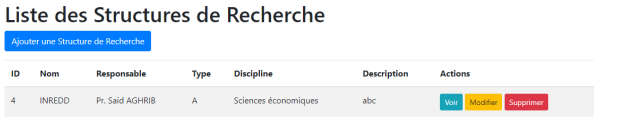

<p align="center"><a href="https://laravel.com" target="_blank"></a></p>

# 🎓 CED Doctoral Process Management – Laravel Web App

This project is a Laravel-based web application developed to manage the doctoral process lifecycle for the **Centre des Études Doctorales (C.E.D.)** at the Université Cadi Ayyad, Marrakech.

It offers an intuitive interface and a robust backend system for handling user registration, research structures, application forms, and doctoral student records.

---

## 📌 Table of Contents

- [Features](#️features)
- [Technologies Used](#technologies-used)
- [Installation](#installation)
- [Usage](#usage)
- [Project Structure](#project-structure)
- [Screenshots](#️screenshots)
- [Author](#author)
- [License](#license)

---

## ✅ Features

- 👤 **User Management** (admin, staff, student roles)
- 🏛️ **Research Structures** creation and management
- 📄 **Pre-registration Forms** with validation
- 📁 **Doctoral Dossier** submission and tracking
- 🔐 **Secure Authentication** (Laravel Auth / Sanctum)
- 🗃️ **Database Integration** (PostgreSQL or MySQL)
- 🧾 **Admin Dashboard** for record monitoring

---

## 🧰 Technologies Used

- **Backend Framework:** Laravel 10.x (PHP)
- **Frontend:** Blade templates, HTML5, CSS3, Bootstrap
- **Database:** PostgreSQL or MySQL
- **Authentication:** Laravel Auth / Laravel Breeze
- **Developer Tools:** Artisan CLI, Laravel Debugbar, Laravel Tinker

---

## ⚙️ Installation

```bash
# 1. Clone the repository
git clone https://github.com/yourusername/ced-doctoral-process-management.git
cd ced-doctoral-process-management

# 2. Install dependencies
composer install
npm install && npm run dev

# 3. Copy .env and configure
cp .env.example .env
php artisan key:generate

# 4. Configure your DB credentials in .env

# 5. Run migrations
php artisan migrate

# 6. Launch the dev server
php artisan serve

---

## ▶️ Usage

After setup:

- Visit `http://127.0.0.1:8000`
- Register or seed an admin account
- Use the admin dashboard to manage users, research structures, and applications

---

## 🗂️ Project Structure (simplified)

├── app/ │ ├── Http/Controllers/ │ ├── Models/ ├── resources/ │ └── views/ ├── routes/ │ └── web.php ├── database/ │ └── migrations/ ├── public/ ├── .env.example └── README.md

---

## 🖼️ Screenshots

### 📘 Diagramme de cas d'utilisation


### 📌 Étapes pour l'étudiant admis


### 👨‍🎓 Liste des étudiants admis


### 👨‍🏫 Liste des professeurs


### 📄 Liste des sujets


### 🎯 Mission du CED (volets 1 & 2)


### 🏢 Organigramme du CED


### 🧪 Liste des structures de recherche


---

## 👩‍💻 Author

**Nissrine Elabjani**  
2nd Year Engineering Student – Embedded Systems  
Université Paris Cité – Denis Diderot Engineering School  
📍 Paris, France  
🔗 [LinkedIn](https://linkedin.com/in/nissrine-elabjani-296598291)  
📧 nissrine.elabjani@gmail.com

---

## 👩‍💻 Author

**Nissrine Elabjani**  
2nd Year Engineering Student – Embedded Systems  
Université Paris Cité – Denis Diderot Engineering School  
📍 Paris, France  
🔗 [LinkedIn](https://linkedin.com/in/nissrine-elabjani-296598291)  
📧 nissrine.elabjani@gmail.com

---

## 📄 License

This project is licensed under the MIT License.  
You are free to use, modify, and distribute this code with attribution.


